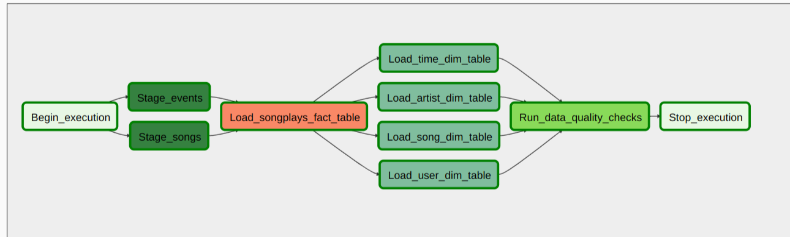

# Data_pipelines_with_Airflow

tags
---------
Project Introduction
---------
What needs to be done
---------
Project Structure
---------
Setting up airflow in docker
---------
Setting up the variables in airflow
---------
### The Project DAG in Airflow :
 

  

<!-- Connect with me -->

   

  

