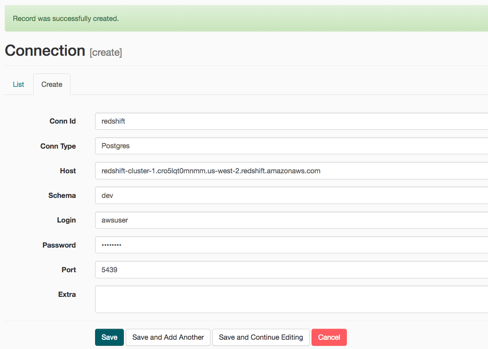

# Data_pipelines_with_Airflow


 


 


<!-- ABOUT THE PROJECT -->
## About The Project

A music streaming company, Sparkify, has decided that it is time to introduce more automation and monitoring to their data warehouse ETL pipelines and come to the conclusion that the best tool to achieve this is Apache Airflow.

They would like a data engineer to create high grade data pipelines that are dynamic and built from reusable tasks, can be monitored, and allow easy backfills. In order to ensure data quality (as it plays a big part when analyses are executed on top the data warehouse) they want to run tests against their datasets after the ETL steps have been executed to catch any discrepancies in the datasets.

The source data resides in S3 and needs to be processed in Sparkify's data warehouse in Amazon Redshift. The source datasets consist of JSON logs that tell about user activity in the application and JSON metadata about the songs the users listen to.

<br>

### Project Description

In this project, the data engineer is required to create their own custom operators to perform tasks such as staging the data, filling the data warehouse, and running checks on the data as the final step. The flow of the project is such that, the data is loaded into the staging tables from the log files (that are stored in S3). From the staging tables, the data is processed and loaded into the fact and dimension tables. All the different operations of the pipeline are defined as operators and are triggered as soon as their dependency is met, by Airflow. 

<br><br>

### The Project DAG in Airflow :
<br>
<div align=center>


</div>
<br><br>

### Datasets :

<br>

For this project, there are two datasets, stored in S3:

* Log data: ``` s3://udacity-dend/log_data ```

* Song data:  ``` s3://udacity-dend/song_data ```

<br><br>

### Project Structure

<br>

The whole project directory structure is as follows :
<br>
<div align=center>


</div>

* etl_dag.py : The file contains the code that defines the DAG and its different tasks. The dependencies between the different tasks are also defined in this file.

* sql_queries.py : The file contains the SQL queries for inserting data into the redshift tables.

* data_quality.py : The data quality check operator is defined in this file. This is run towards the end of the pipeline inorder to check data quality.

* load_dimension.py : The operator for loading data into the dimension tables is defined in this file.

* load_fact.py : The operator for loading data into the fact table is defined in this file.

* stage_redshift.py : In this file, the operator for loading data into the staging tables from the json log files, is defined.

* create_tables.sql : This file contains the SQL queries for creating all the required tables (staging, fact and dimension).

<br><br>

### Setting up the Project

In order to run this project, we would need :

* A Redshift Cluster
* AWS User Credentials (Access Key ID and Secret Access Key)

Setting up Airflow
---
If you are planning on running Airflow in your local system, you have 2 options :

*  [Running Airflow locally](https://airflow.apache.org/docs/apache-airflow/stable/start/local.html)

*  [Running Airflow in Docker](https://airflow.apache.org/docs/apache-airflow/stable/start/docker.html)

Personally I prefer the Docker setup, due to its simplicity.

Adding Airflow Connections
---
Once the Airflow web server is deployed, open http://localhost:8080 in Google Chrome (other browsers occasionally have issues rendering the Airflow UI) and add the following Connections (Admin=>Connections):

<br>
<div align=center>


</div>

<br>
<div align=center>


</div>

And the final step is to the run the dag.

<!-- Connect with me -->
<div align=center>
<br><br><br>

[](https://www.linkedin.com/in/deepankar-acharyya-034053a5/)

[](https://github.com/DeepankarAcharyya)

<br><br>
</div>